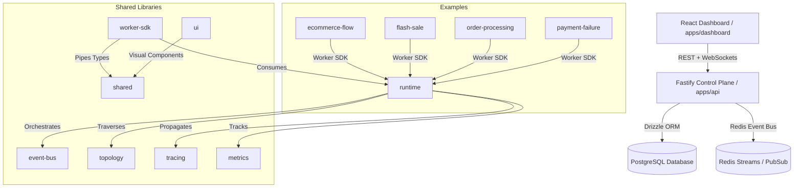

# BeyondEvent

> Making Event-Driven Systems Observable, Understandable, and Interactive.

BeyondEvent is a production-grade orchestration and observability platform for designing, simulating, executing, tracing, debugging, and testing event-driven microservices. It equips developers with real-time dependency topology visualisations, distributed tracing logs, saga orchestration metrics, and built-in chaos engineering capabilities.

---

## Architecture Diagram



---

## Monorepo Directory Structure

The project is structured as a monorepo managed via **Turbo** and **pnpm Workspaces**:

### Applications (`/apps`)
*   **[api](file:///C:/Users/mobas/projects/beyondevent/apps/api)**: Fastify-based control plane server exposing REST endpoints and WebSockets for real-time state synchronization.
*   **[dashboard](file:///C:/Users/mobas/projects/beyondevent/apps/dashboard)**: Vite-powered React dashboard utilizing dynamic topological graphs (via React Flow) to visualise event propagation.
*   **[docs](file:///C:/Users/mobas/projects/beyondevent/apps/docs)**: Documentation website detailing architecture plans and system layouts.

### Shared Packages (`/packages`)
*   **[ui](file:///C:/Users/mobas/projects/beyondevent/packages/ui)**: Central library containing reusable design tokens and shared components (Shadcn UI, MagicUI grid backgrounds, data tables, and forms).
*   **[runtime](file:///C:/Users/mobas/projects/beyondevent/packages/runtime)**: Core event runtime engine managing task queues, simulation flows, step dispatches, and step retries.
*   **[event-bus](file:///C:/Users/mobas/projects/beyondevent/packages/event-bus)**: Transport abstraction interface defining publishers, consumers, and message brokers (e.g. Memory-based, Redis-based).
*   **[worker-sdk](file:///C:/Users/mobas/projects/beyondevent/packages/worker-sdk)**: Framework-level SDK used to define node steps and instantiate step-worker instances.
*   **[topology](file:///C:/Users/mobas/projects/beyondevent/packages/topology)**: Direct-graph structure definitions, validation layers, loop detection, and path execution traversal helpers.
*   **[tracing](file:///C:/Users/mobas/projects/beyondevent/packages/tracing)**: Structural metadata context providers handling distributed trace propagation (`TraceId`, `SpanId`, `CorrelationId`, `CausationId`).
*   **[metrics](file:///C:/Users/mobas/projects/beyondevent/packages/metrics)**: Observability client defining counter, gauges, histograms, and latency timers.
*   **[shared](file:///C:/Users/mobas/projects/beyondevent/packages/shared)**: Basic type definitions, error envelopes, and utility functions shared across all domains.

### Simulation Examples (`/examples`)
*   **[ecommerce-flow](file:///C:/Users/mobas/projects/beyondevent/examples/ecommerce-flow)**: Full order transaction simulation including checkout, inventory reserving, payment billing, and package shipping.
*   **[flash-sale](file:///C:/Users/mobas/projects/beyondevent/examples/flash-sale)**: Simulates high-concurrency event validation during stock countdown locks.
*   **[order-processing](file:///C:/Users/mobas/projects/beyondevent/examples/order-processing)**: Demonstrates standard multi-state saga transactions.
*   **[payment-failure](file:///C:/Users/mobas/projects/beyondevent/examples/payment-failure)**: Focuses on timeouts, retries, saga rollbacks, and recovery event triggers.

---

## Prerequisites

Ensure you have the following installed on your machine:
*   **Node.js** v24+
*   **pnpm** v9+ (Workspaces enabled)
*   **Docker** (with Docker Compose)

---

## Getting Started

Follow these steps to set up the project locally:

### 1. Clone & Install Dependencies
```bash
# Clone the repository and navigate inside the workspace
cd beyondevent

# Install all workspace package dependencies
pnpm install
```

### 2. Launch Local Database & Broker
Use Docker Compose to launch a PostgreSQL database instance and a Redis server for background message brokerage:
```bash
docker compose up -d
```

### 3. Configure Environment Variables
Copy the environment variables template and customize it if needed (defaults are pre-configured for the docker container):
```bash
cp .env.example .env
```

### 4. Apply Database Migrations
Initialize database tables using **Drizzle ORM**:
```bash
# Generate the migration files
pnpm db:generate

# Execute migration scripts against PostgreSQL
pnpm db:migrate
```

### 5. Compile Workspace Packages
Build shared workspaces and packages using Turbo:
```bash
pnpm build
```

### 6. Run control-plane and Dashboard
Start the development server for the control plane API and the React client dashboard:
```bash
pnpm dev
```
*   **React Dashboard**: [http://localhost:5173](http://localhost:5173)
*   **Control Plane API**: [http://localhost:3000](http://localhost:3000)

---

## Simulating & Seeding Event Data

To populate the dashboard and see events propagate through the topologies in real-time, run one of the simulation examples. 

For instance, to run the **e-commerce checkout simulation**:
```bash
pnpm --filter @beyondevent/examples-ecommerce-flow seed
```
This script will:
1. Connect to the Control Plane API.
2. Link and create the e-commerce transaction topology.
3. Spawn worker handlers (Inventory, Payment, Shipping) using the Worker SDK.
4. Publish mock checkout requests and execute actions across the flow.

---

## Developer Command Reference

| Action | Command | Purpose |
| :--- | :--- | :--- |
| **Install** | `pnpm install` | Setup node dependencies across all packages. |
| **Build** | `pnpm build` | Compile libraries and build production bundles. |
| **Dev** | `pnpm dev` | Run Fastify and Vite client in live reload mode. |
| **Migrate** | `pnpm db:migrate` | Apply schema updates to Postgres. |
| **Studio** | `pnpm db:studio` | Launch Drizzle Database admin panel. |
| **Format** | `pnpm format` | Run Biome formatter checks and apply fixes. |
| **Lint** | `pnpm lint` | Execute Biome static code analysis rules. |
| **Test** | `pnpm test` | Run Vitest suite across workspaces. |
| **Clean** | `pnpm clean` | Wipe local build cache and build folders. |

---

## Visual Design System & UI Guidelines

BeyondEvent features a high-fidelity, premium developer console design built on top of customized styling standards:

1. **Sharp UI Geometry (`rounded-none`)**:
   * All borders, overlays, inputs, buttons, navigation pills, active status indicators, and badges must remain sharp with **no rounded corners**. Avoid classes like `rounded-lg` or `rounded-full` in dashboard layout modifications.
2. **Glassmorphic Transparency**:
   * Sidebar controls, event lists, and page cards utilize semi-opaque card backgrounds (`bg-card/45 backdrop-blur-md` or `bg-card/50 backdrop-blur-md`) to let the underlay coordinates of MagicUI grid patterns bleed through.
3. **Smooth Search Loader States**:
   * Search input fields (Simulations, Topologies, Workers) are integrated with a custom `useDebounce` hook to prevent rapid successive database calls.
   * Typing triggers a Lucide spinner inside the input container immediately, while the table body transitions with a subtle opacity dim (`opacity-60 pointer-events-none`) to eliminate sudden layout snapping.
